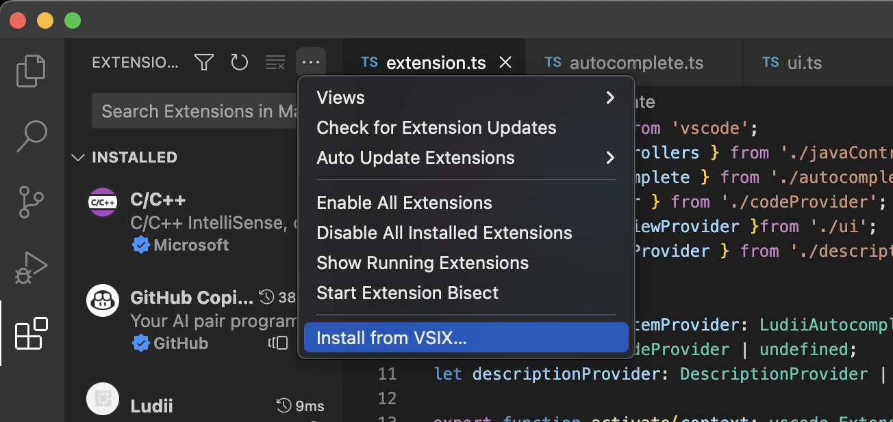
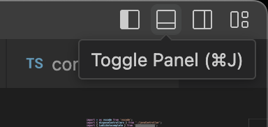
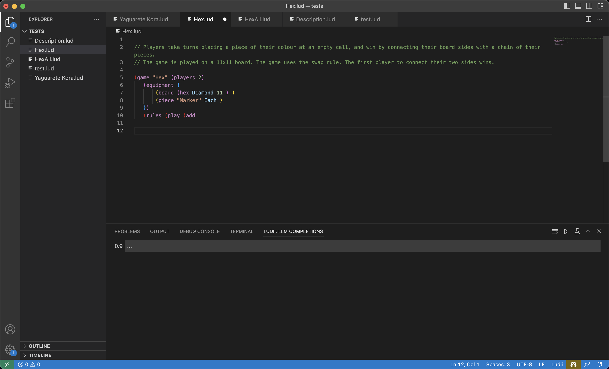

# Ludii extension for VSCode

## Features

 * Syntax highlighting 
 * Compilation and Evaluation
 * Intellisense autocomplete based on the SymbolMapper class
 * English Rule generation using GPT-3.5 and the Recommender System
 * English to Ludii translation based on fine-tuned LLaMa 7b

## Requirements

* Java 11
* Access to an inference server with a V100 GPU or above
* Access to an OpenAI key

## Installation
 1. Download the [packaged extension](https://drive.google.com/file/d/1l_D2bjYn0Eqw3eaYgnJOyqlXLIfpsRS3/view?usp=sharing)
 2. Install the extension by selecting `Extensions/.../Install from VSIX`
   
    
 5. Open the bottom pannel
    
    
 6. Open a .lud file and select the LUDII window
   
    

## Usage
### Recommender System
 1. Copy and OpenAI API Key (we'll need it in step 3)
 2. Create and empty `.lud` file
 3. Click on the green arrow to complete the Recommender Survey. (The UI will freeze for a few seconds when it's done. Try to avoid clicking muliple times)
 4. The window will close and soon after you will be prompted to paste the key in a dialogue box.
 5. Below the rules for a new game will be streamed in real time. You can copy them into the file and modify them as you see fit. (Note that simpler games will tend to work much better in the following steps)

### Generation
 1. Follow the instructions in the [Colab Notebook](https://colab.research.google.com/drive/1HDbWCuMYz_6vZR5-mrAQs0NGNPMUzxtC?usp=sharing) to obtain a public url. Unfortunatelly the inference server requires a premium Colab account.
 2. Type "(game "
 3. Click on the beaker and paste the public URL in the dialogue box. You may also click the green arrow in this step to use the standard compiler instead of the partial compiler. You may want to do this to inspect the raw output of the model or to support definitions. Using the Partial compiler (beaker) will guarantee that compelete completions compile, but it does not support definitions yet.
 4. Bellow, many possible completions will start streaming in. You can select any completion to inspect it. As the completions start getting large enough that they compile, they will be evaluated with the evaluation metrics and sorted accordingly.

### Autocomplete 
 * At any point you may inspect which ludemes are available by pressing `ctrl+space`.

### Syntax higlighting
 * Syntax higlighting is already enabled for any `.lud` and `.def` file.
